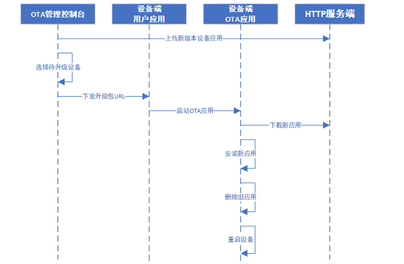

# 钛极OS(TiJOS)远程升级(OTA)应用指南

远程OTA是目前物联网设备必备的升级方式，在设备出现BUG或业务调整时通过OTA可以达到现场设备的远程快速升级。 

钛极OS内置支持通过OTA空中下载的方式对用户应用进行升级，通过HTTP方式即可快速进行OTA部署及升级， 用户只需要在程序代码中直运行行官方提供的tijos-http-ota应用即可， 同时官方也提供了 tijos-http-ota的源码方便用户根据业务需求自行调整， 钛极OS以独立应用的方式提供OTA支持，用户只需预置在设备中，对用户应用影响极小。

## 升级流程

OTA升级流程如下图所示：

#### 流程说明

1. 设备中预置置ota应用tijos-http-ota
2. 将新版本用户应用tapk文件上传至http服务器
3. 对所需要升级的设备下发升级指令，在指令中将新应用的url下发给设备， url长度应小于128
4. 设备收到后，解析url并通过参数启动tijos-http-ota应用进行升级
5. ota应用通过url下载、安装、删除旧应用并重新启动运行新应用。
6. 升级完成

## 部署要求 

### HTTP服务器

用于存放tapk应用文件, 可通过HTTP进行远程访问，考虑安全时可在URL参数中加入检验机制。 

### 预置OTA应用

设备在发行前需要预置官方提供的tijos-http-ota应用，或者用户在其代码基础上改过的ota应用。

### OTA管理控制台指令下发

可通过物联网平台下发指令来触发启动OTA流程， 具体下发方式可根据业务需求来自行设计，如MQTT等

### 用户应用中加入OTA支持

用户在应用中根据平台指令来使用正确的参数启动tijos-http-ota应用， 该应用会自动通过HTTP URL下载指定的tapk完成新应用下载、安装、自动删除旧应用并重新启动设备，相应的代码如下所示：

~~~java
//获取当前应用ID
TiAPP currApp = TiAPPManager.getInstance().getRunningAPP();

//旧应用ID
int oldAppId = currApp.getId();

//OTA 应用名称
String otaAppName = "tijos-http-ota";

//获取OTA应用
TiAPP otaApp = TiAPPManager.getInstance().getAPP(otaAppName);
if (otaApp == null) {
    throw new IOException("OTA App is not found: " + otaAppName);
}

//新应用URL
String otaAppUrl = "http://img.tijos.net/img/tiwl-aep.tapk";

//参数
String appArgs = oldAppId + " " + otaAppUrl;

//启动OTA应用
otaApp.execute(true, appArgs);

~~~

## 注意事项

1. 升级前确保新应用经过充分验证
2. 如果设备较多，考虑到HTTP服务器压力，升级时建议分批升级
3. 安全性设计：可通过动态URL并在其中加入校验信息来保证安全性

## 参考

- tijos-http-ota源码： https://github.com/TiJOSteam/tijos-http-ota
- 在应用中启动OTA参考：https://github.com/TiJOSteam/tijos-http-ota/blob/main/sample/OTASample.java

## 技术支持

如果您有任何技术问题，可通过电话，微信， QQ群等方式与我们联系， 同时钛云物联可提供产品定制，通讯协议开发，云端接入，技术培训等多种服务。

## 更多资源

关于钛极OS(TiJOS)物联网操作系统可参考如下资源：

| 资源           | url                                    |
| -------------- | -------------------------------------- |
| 钛云物联官网   | [www.tijos.net](http://www.tijos.net/) |
| 钛极OS文档中心 | [doc.tijos.net](http://doc.tijos.net/) |
|                |                                        |

## 联系方式

北京钛云物联科技有限公司

商务合作：13911058165

品牌热线：010-86462928

公司网址：[www.tijos.net](http://www.tijos.net/)

电子邮件：[tijos@tijos.net](mailto:tijos@tijos.net) 

在线购买: https://shop423269048.taobao.com/